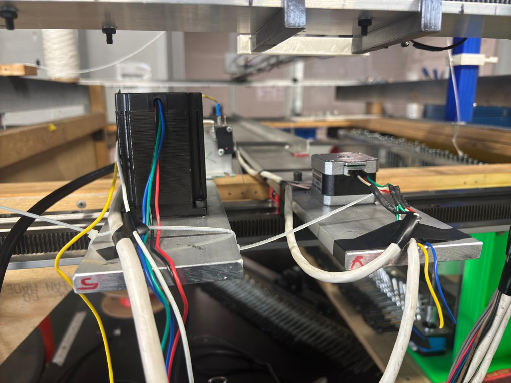
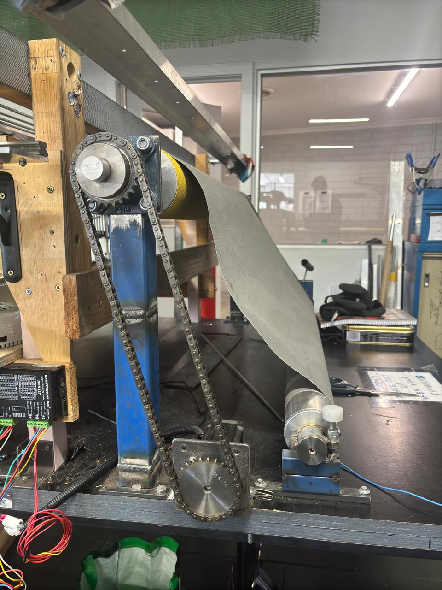
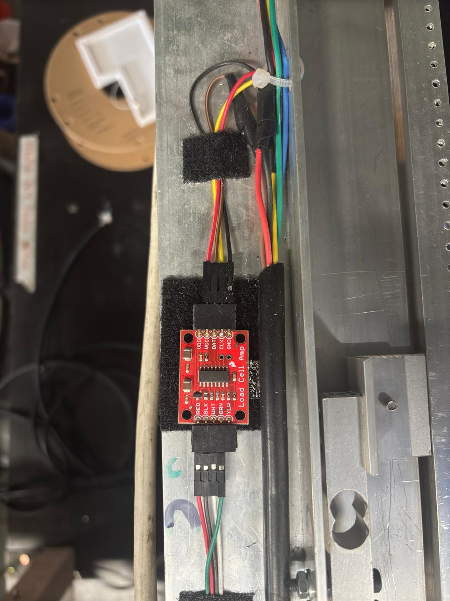
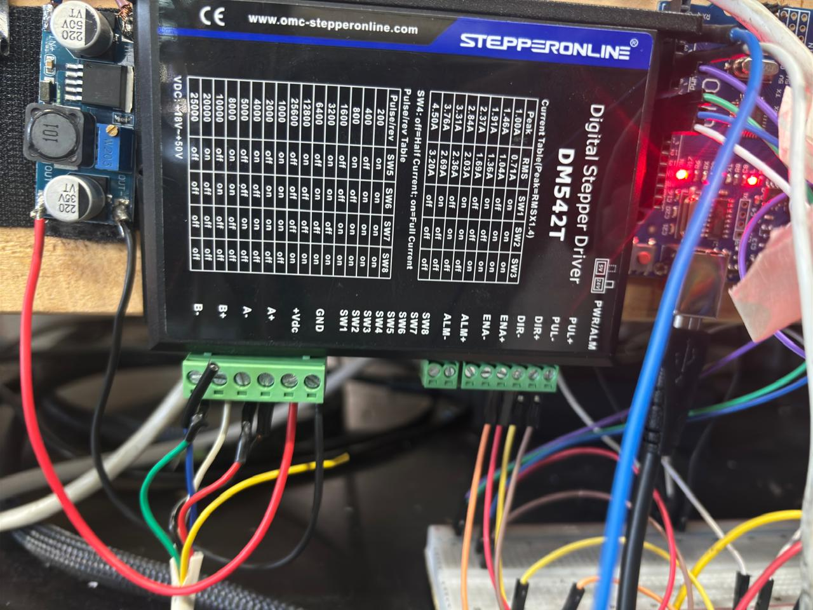
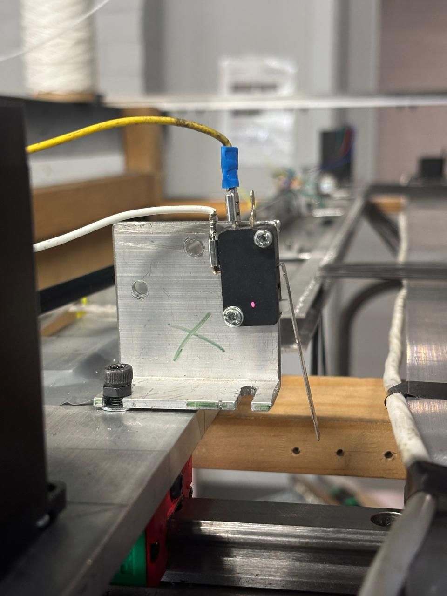
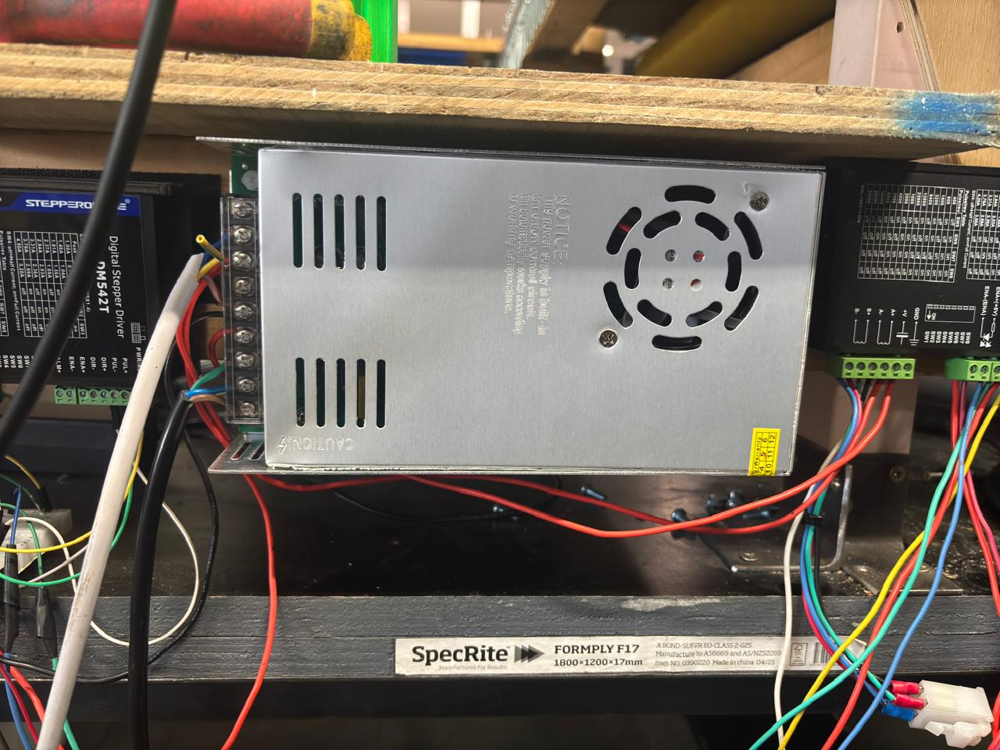
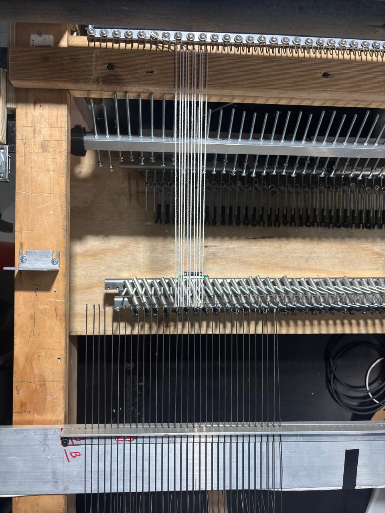
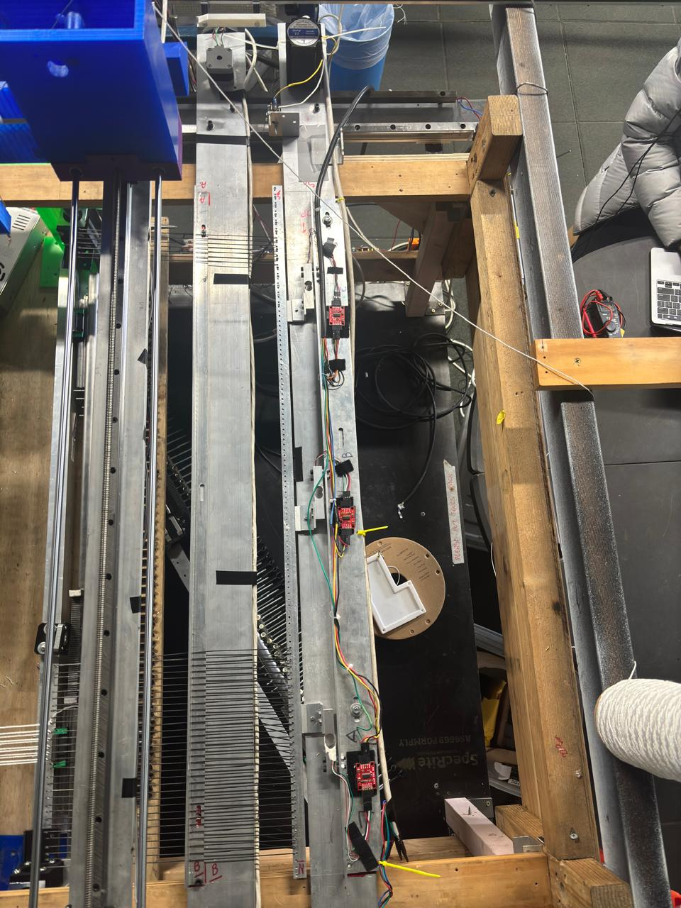

# Fully Automatic Trampoline Machine — Warp Tension Control System

A closed-loop, five-axis warp tension control system developed for automating trampoline mat weaving. Built during a Work Integrated Learning (WIL) placement with Mr Trampoline, Melbourne, in collaboration with RMIT University.


## Overview

Trampoline mat manufacturing traditionally relies on skilled operators to manually tension, hook, and align threads — a process that's slow, inconsistent, and physically demanding. This project replaced manual tension control with a fully automated, feedback-controlled system using stepper motors, load cell sensors, and an Arduino-based controller.

The system coordinates five stepper motors across multiple axes to maintain uniform warp tension during the weaving cycle, achieving performance comparable to industrial PLC-based systems at a fraction of the cost.

> **Note:** This project was developed for Mr Trampoline (Melbourne). CAD files, proprietary design details, and source code are not included to protect company IP. This repository documents the engineering process, system architecture, and results.

## The Problem

The previous semi-automatic prototype had several limitations:

- Tension measured at a single fixed point — no data across the full mat width
- Independent motor drives caused phase mismatches and uneven beam displacement
- Power supply couldn't sustain the combined load of multiple motors, causing voltage drops and trips
- Manual calibration required between every run

## My Solution

### System Architecture

```
                         ┌──────────────┐
                         │  Set-Point   │
                         │  Ts = 3.0 kg │
                         └──────┬───────┘
                                │
                    ┌───────────▼───────────┐
                    │    Arduino UNO        │
                    │  Closed-Loop Control  │
                    │  e(t) = Ts - Tm       │
                    └───┬───────────┬───────┘
                        │           │
              ┌─────────▼──┐   ┌───▼──────────┐
              │  DM542T    │   │  3× HX711    │
              │  Drivers   │   │  Load Cells  │
              └─────┬──────┘   └───┬──────────┘
                    │              │
        ┌───────────▼──────────┐   │ Feedback
        │   5× Stepper Motors  │   │ (real-time
        │                      │   │  tension)
        │  2× NEMA-23 Support  │   │
        │  2× NEMA-17 Rest     ◄───┘
        │  1× NEMA-27 Roller   │
        └──────────────────────┘
```

### Control Logic

The controller compares measured tension (Tm) against a 3.0 kg set-point within a ±0.2 kg tolerance band:

- **Tm > 3.2 kg** → beams move forward to relieve tension
- **Tm < 2.8 kg** → beams move backward to tighten warp
- **2.8–3.2 kg** → stable, all beams advance synchronously and roller reels in mat

Tension sampled at ~2 Hz, averaged over 5 readings to reduce noise.

## Hardware

| Component | Specification | Role |
|-----------|--------------|------|
| NEMA-23 (×2) | 24V, 3A, 1.26 N·m, 1.8° | Support beam drive pair |
| NEMA-17 (×2) | 24V, 2A, 0.45 N·m, 1.8° | Rest beam drive pair |
| NEMA-27 (×1) | 48V, 4.2A, 3.0 N·m, 1.8° | Reeling roller |
| DM542T Drivers | 48V, 3.2A peak, 1/16 microstep | One per motor group |
| Load Cells + HX711 | 3× 5 kg cells | Real-time tension feedback |
| Arduino UNO | 5V, 16 MHz | Central controller |
| Power Supply | 48V 10A SMPS + buck-boost 12–30V | Motor power |
| Limit Switches | 3× mechanical, active-LOW | End-stop safety |

## Mechanical Design

The prototype uses a 120 cm × 100 cm frame supporting two motion beams and a reeling system:

- **Support beam** and **rest beam** ride on parallel rails, driven through rack-and-pinion assemblies
- **Reeling roller** at the front, coupled via chain-sprocket to the NEMA-27 motor
- Warp path runs from support beam → rest beam → roller
- Tensiometers mounted on the support beam for dynamic measurement
- Limit switches at rail ends and midway for safety

All CAD modelling was done in **Fusion 360**, including mechanism design for thread tensioning and hooking, accounting for friction, elasticity, and real-time load variations.

## Results

| Metric | Value |
|--------|-------|
| Target tension | 3.0 kg |
| Achieved stability | ±0.25 kg (±7%) |
| Settling time | 3–5 seconds after disturbance |
| Beam synchronisation gap | 4–5 cm (constant) |
| Tension variation improvement | ~70% reduction vs. previous semi-auto design |
| Comparable to industrial PLC accuracy | Within ±7% vs. industrial ±5% |

## Key Engineering Challenges Solved

**Multi-motor synchronisation** — Coordinating five motors (three different types) through interleaved stepping to maintain phase alignment across all axes.

**Power system redesign** — Original SMPS couldn't handle simultaneous motor loads. Added buck-boost converter for NEMA-17 voltage regulation, eliminating torque fluctuations and reducing tension variation from ±0.4 kg to ±0.25 kg.

**Driver current tuning** — DIP switch calibration of DM542T drivers for each motor type: lower current for NEMA-17 (reduce heat), higher for NEMA-23 (maintain beam stiffness).

**Sensor calibration** — Iterative calibration of HX711 modules against reference scale across 2.5–3.5 kg range, achieving ±0.2 kg repeatability with calibration factor of 72,000.

**Mechanical alignment** — Rack-and-pinion repositioning to accommodate weft-insertion mechanism from another sub-team, while maintaining symmetrical beam motion.

## Photos


















## Repository Structure

```
├── images/
│   ├── machine_full_frame.jpg
│   ├── cad_model.jpg
│   ├── motors_on_beams.jpg
│   ├── reeling_roller.jpg
│   ├── load_cell_hx711.jpg
│   ├── driver_wiring.jpg
│   ├── limit_switch.jpg
│   ├── smps_power_supply.jpg
│   ├── threads_on_hooks.jpg
│   └── beam_gap.jpg
├── docs/
│   └── system_architecture.pdf
└── README.md
```

## Context

This project was completed as part of the **OENG1090 Work Integrated Learning** course at RMIT University (Feb 2025 – Nov 2025), supervised by **Professor John Mo** and **Professor Pavel M. Trivailo**, with industry mentorship from **Mr George** at Mr Trampoline.

The work built upon a Semester 1 open-loop prototype and transformed it into a fully closed-loop, feedback-controlled automation system across two semesters.

## Skills Demonstrated

- Electromechanical system design and integration
- CAD modelling and mechanism design (Fusion 360)
- Multi-axis stepper motor control and synchronisation
- Sensor integration and calibration (load cells, HX711)
- Closed-loop feedback control design
- Power electronics (SMPS, buck-boost converters, driver tuning)
- Technical documentation and stakeholder communication
- Iterative testing and structured problem-solving

## License

This repository is for portfolio and documentation purposes only. Proprietary designs, source code, and manufacturing details belonging to Mr Trampoline are not included.
